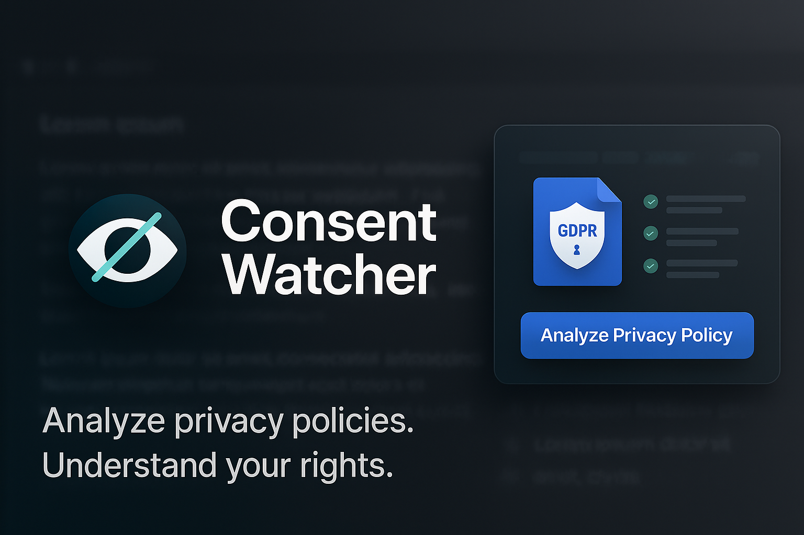

<div align="center">

<p align="center">
  
</p>

# Consent Watcher Lite

[](https://www.tampermonkey.net/)
[](LICENSE)
[](https://github.com/your-username/your-repo-name/graphs/commit-activity)

<i>Analyze privacy policies effortlessly, right in your browser.</i>

</div>

**Consent Watcher Lite** is a Tampermonkey userscript that uses the OpenAI API to analyze privacy policies of websites you visit. It highlights key points like data collection, third-party sharing, user rights, tracking, and GDPR compliance.

---

## Features

- **One-click analysis**: A button appears on websites to trigger the scan.
- **Key insights**:
  - Types of personal data collected
  - Third-party sharing
  - Tracking technologies used
  - User rights summary
  - GDPR compliance estimate
- **Actionable privacy tips** tailored to each policy
- **Downloadable HTML report**
- **Popup interface**: draggable and closable

---

## Getting Started

1. Install [Tampermonkey](https://www.tampermonkey.net/).
2. Add the script via the **Raw** button on GitHub or paste it manually in a new script.
3. Open the script and set your OpenAI API key in the `openAiApiKey` variable:
   ```js
   const openAiApiKey = 'your-api-key-here';
4. Visit any site, click "Analyze Privacy Policy," and view the results in a popup.

---

## Privacy

- Only visible page text is sent to OpenAI’s API for analysis.
- No local data is stored.
- Fully open-source for transparency.

> **Note**: This tool provides automated analysis and is not a substitute for legal advice.

---

## Contributing

Contributions are welcome ! You can modify and improve the project by submitting merge requests anytime.

> <i>Understand your privacy rights. Effortlessly.</i>
